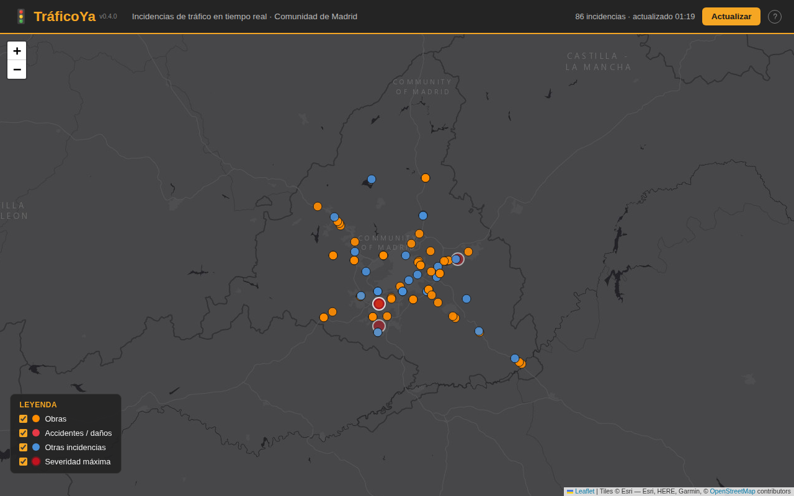

#  TráficoYa


Mapa en tiempo real de incidencias de tráfico en la Comunidad de Madrid, con datos abiertos de
la DGT — obras, accidentes, cierres y demás incidencias activas, filtrables por tipo o por
carretera/municipio, con detalles al tocar cada una. Funciona como PWA instalable en el móvil.

Tercer proyecto de una serie de apps con APIs públicas para portfolio, junto a
[Disaster Watch](https://github.com/rzazo24/disaster-watch) (GDACS) y
[BusYa](https://github.com/rzazo24/busya) (EMT Madrid + CRTM).



## Stack

- Frontend: HTML/CSS/JS vanilla (sin frameworks, sin build step) + [Leaflet](https://leafletjs.com/)
- Backend: función serverless de Node.js en Vercel (`api/incidencias.js`)
- Datos: feed DATEX2 v3.7 de la DGT (`https://nap.dgt.es/datex2/v3/dgt/SituationPublication/datex2_v37.xml`)

## Filtros de la leyenda

Cada tipo de incidencia (obras, accidentes/daños, resto, severidad máxima) se puede ocultar del
mapa tocando su casilla en la leyenda — se aplica al instante, sin recargar ni esperar al
próximo refresco, y se mantiene aunque los datos se actualicen solos cada 3 minutos.

## Buscador y ubicación

El buscador de arriba a la derecha del mapa filtra al instante por nombre de carretera o
municipio (acentos y mayúsculas no importan), sugiriendo coincidencias mientras escribes
(navegables con teclado) y encuadrando el mapa sobre los resultados; se combina con los
filtros de la leyenda. El botón de al lado pide la ubicación al navegador, la marca en el mapa
y añade la distancia a cada incidencia en su propio popup.

## Enlace compartible

Al abrir el popup de una incidencia, la URL se actualiza sola con `?id=` (sin recargar ni
generar entradas nuevas en el historial) — copiarla desde el navegador basta para compartir esa
incidencia en concreto. El icono junto al título del popup hace lo mismo con un toque: abre el
diálogo nativo de compartir en móvil, o copia el enlace si el navegador no lo tiene. Abrir un
enlace con `?id=` de una incidencia que ya se resolvió avisa en vez de fallar en silencio.

## Vista en lista

El icono de lista de la cabecera abre las mismas incidencias que ve el mapa (con los filtros
de la leyenda y del buscador ya aplicados) como texto navegable — pensada sobre todo para quien
no puede o no quiere depender del mapa, ya que sus marcadores no son accesibles por sí mismos
para un lector de pantalla. Ordenable por severidad (por defecto) o por distancia, si ya has
activado tu ubicación. Tocar una fila cierra la lista y abre esa incidencia en el mapa.

## Ayuda

El botón "?" de la cabecera abre un panel con una explicación del mapa, los colores de los
marcadores, la cadencia de actualización y el origen de los datos, más una sección de
**estado de la API** que mide en directo cuánto tarda `/api/incidencias` en responder (con un
botón para comprobarlo de nuevo cuando quieras).

## Analíticas

Vercel Web Analytics (visitas y Core Web Vitals, sin cookies ni datos personales) mediante la
integración por `<script>` para sitios sin framework — no necesita instalar ningún paquete.
Hace falta activarlo también en el dashboard del proyecto en Vercel (Analytics → Enable) para
que empiece a recoger datos.

## Endpoint `/api/incidencias`

Devuelve un array JSON con las incidencias activas cuya provincia (`lse:province`) es Madrid:

```json
[
  {
    "id": "22832648",
    "tipo": "roadMaintenance",
    "descripcion_tipo": "Obras de mantenimiento: obras en la calzada",
    "carretera": "M-50",
    "lat": 40.3338,
    "lon": -3.6281,
    "municipio": "Madrid",
    "kilometro": 37,
    "sentido": "sentido noreste",
    "carril": "vía de salida, carril izquierdo",
    "fecha_inicio": "2026-07-10T10:55:00.000+02:00",
    "fecha_fin": "2026-10-30T05:30:00.000+01:00",
    "severidad": null
  }
]
```

Para incidencias en tramo de carretera (con `loc:from`/`loc:to`), `lat`/`lon` es el punto medio del tramo. Se cachea 2 minutos (`s-maxage=120`) para no saturar el feed de la DGT.

## PWA

Instalable desde el navegador ("Añadir a pantalla de inicio" / el aviso de instalación de
Chrome) y funciona sin conexión gracias a un service worker (`sw.js`) que cachea el shell
estático (HTML/CSS/JS/manifest/iconos) con una estrategia stale-while-revalidate — nunca las
incidencias en sí, que siempre se piden en vivo a `/api/incidencias`. Revisa si hay
actualización cada vez que la app vuelve a primer plano, no solo con la frecuencia por defecto
del navegador (~24h); al detectar una versión nueva, avisa con un mensaje y un botón "Recargar"
en vez de recargar la pestaña sola.

El número de versión (visible junto al título) se sube a mano junto con `"version"` en
`package.json` y `CACHE_NAME` en `sw.js` en cada despliegue con cambios visibles — subir
`CACHE_NAME` es lo que dispara el aviso de "versión nueva" en quien ya tenga la app abierta o
instalada.

## Estructura

```
traficoya/
├── api/
│   └── incidencias.js        # descarga el XML de la DGT, lo parsea y devuelve JSON filtrado a Madrid
├── public/
│   ├── index.html
│   ├── style.css
│   ├── app.js                # mapa Leaflet, filtros/buscador, geolocalización, panel de ayuda, registro del SW
│   ├── sw.js                 # service worker: cachea el shell estático (nunca las incidencias en vivo)
│   ├── manifest.webmanifest
│   ├── favicon.svg
│   └── icons/
│       ├── icon-192.png
│       ├── icon-512.png
│       ├── icon-512-maskable.png
│       └── apple-touch-icon.png
├── scripts/
│   └── smoke-test.mjs    # npm test — extremo a extremo contra el feed real de la DGT
├── package.json
├── vercel.json
├── LICENSE
├── screenshot.png
└── README.md
```

## Desarrollo local

```bash
npm install
npx vercel dev
```

Esto sirve `public/` como estático y expone `api/incidencias.js` en `http://localhost:3000/api/incidencias`.

## Tests

```bash
npm install
npm test
```

`scripts/smoke-test.mjs` (Playwright) levanta un servidor mínimo propio con el handler real de
`api/incidencias.js` y prueba de extremo a extremo el mapa, los filtros, el buscador con
sugerencias, la geolocalización, el enlace compartible, el panel de ayuda con el estado de la
API, la vista en lista y el service worker — contra el feed real de la DGT, sin necesidad del
CLI de Vercel ni de ninguna credencial.

## Despliegue en Vercel

1. `npx vercel link` (o importa el repo desde el dashboard de Vercel).
2. `npx vercel --prod`.

No hace falta ninguna variable de entorno ni paso de build: el feed de la DGT es público y
Vercel sirve `public/` como estático, desplegando `api/incidencias.js` como Function
automáticamente. El repo está conectado a Vercel y despliega solo en cada push a `main`.

## Licencia

Código bajo licencia MIT (ver [LICENSE](LICENSE)). Los datos de la DGT se rigen por los
términos de uso de su [feed abierto](https://nap.dgt.es/).
